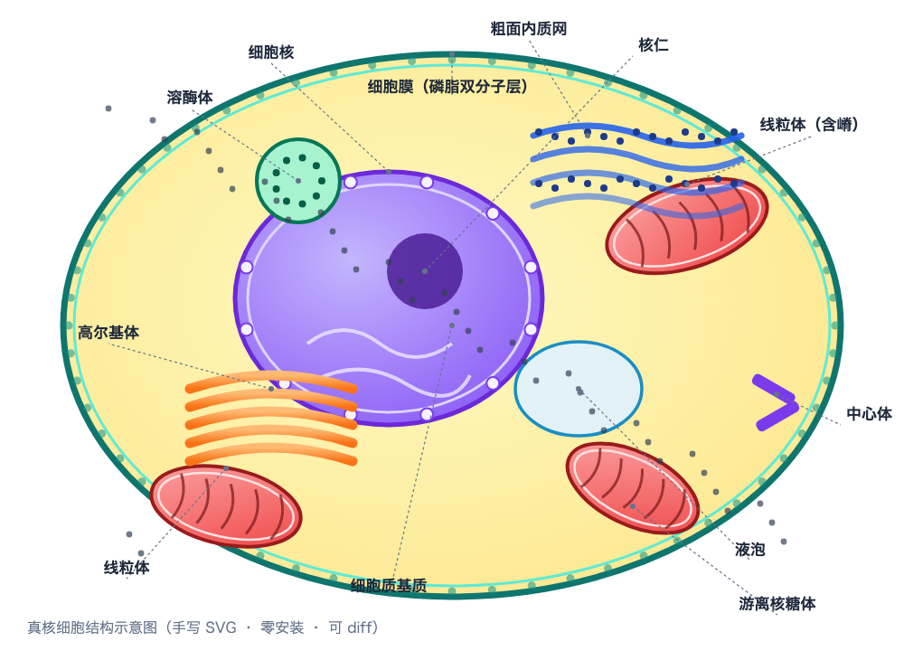
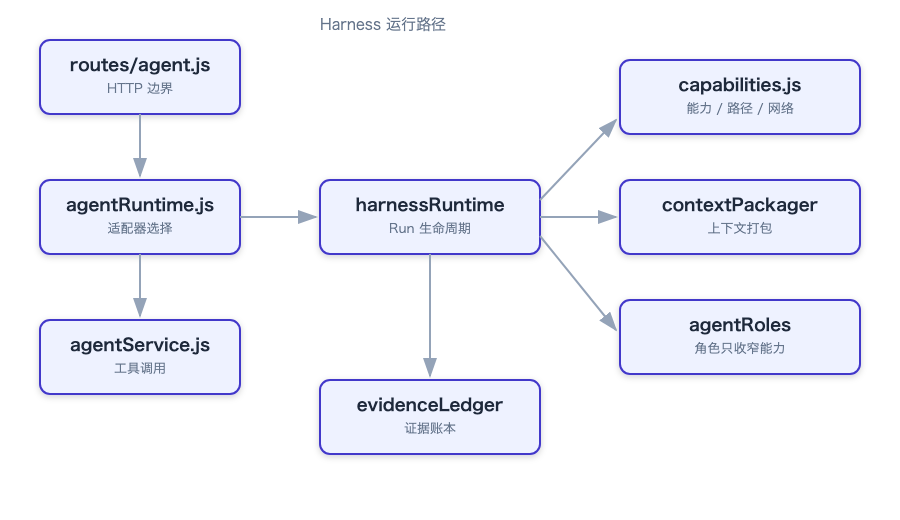
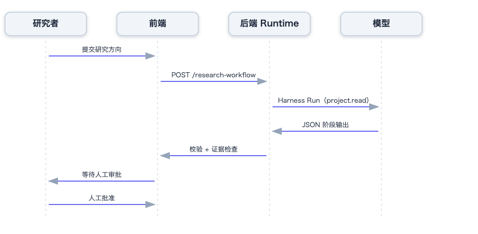

# 文档绘图方案对比（目标 ④）

> 生成时间：2026-09-24 ｜ 迭代 021 ｜ 产物目录：`docs/agent-governance/assets/diagrams/`
> 复现：`node scripts/build-diagrams.mjs`
> **基准不是"线段加方框"**，而是**复杂矢量插画**——细胞结构图（多层形状、渐变、曲线、密集中文标注）。

## 1. 结论

**主方案：手写 SVG**（agent 直接产出 SVG 源码）。

理由不是"最好看"，而是它在本机的**约束条件下唯一同时满足全部硬要求**：

| 要求 | 手写 SVG | 说明 |
| --- | --- | --- |
| 能画复杂矢量插画 | ✅ | 任意路径 / 渐变 / 分组 / 滤镜，细胞结构图已实际渲染验证 |
| 零安装 | ✅ | 不装任何东西；源码就是纯文本 |
| 离线可用 | ✅ | 渲染只用本机已装的 Chrome |
| 中文标签 | ✅ | 系统字体直接可用，实测无豆腐块 |
| 可 diff / 可复现 | ✅ | SVG 是文本，进 git；重渲染逐字节一致 |
| LaTeX / 论文集成 | ✅ | SVG 可转 PDF；`\includegraphics` 与 GUI 都能读 |
| 安装/缓存不越界 | ✅ | 无需 pip / npm / brew |

**渲染链路（零安装）**：

```text
agent 产出 SVG 源码  →  Chrome headless 栅格化  →  PNG 供人目视复核
                      （本机已装，输出落工区内）
```

目视复核用 `read_image`，**不能只看 SVG 里有 `<text>` 就判定通过**——文字可能在 SVG 里而字形缺失。

## 2. 参考图集（4 张，均已实际渲染）

| 图 | 用途 | 产物 |
| --- | --- | --- |
| 模块依赖图 | 架构图（方框箭头基线） | [module-graph.svg](assets/diagrams/module-graph.svg) ｜ [png](assets/diagrams/module-graph.png) |
| 时序流程图 | 泳道 / 交互 | [sequence-flow.svg](assets/diagrams/sequence-flow.svg) ｜ [png](assets/diagrams/sequence-flow.png) |
| **细胞结构图** | **复杂插画基准** | [cell-structure.svg](assets/diagrams/cell-structure.svg) ｜ [png](assets/diagrams/cell-structure.png) |
| 对比图表 | 数据对比 | [comparison-chart.svg](assets/diagrams/comparison-chart.svg) ｜ [png](assets/diagrams/comparison-chart.png) |

### 细胞结构图（基准样例）



已实际渲染并目视确认的内容：细胞膜（含磷脂双分子层与头部圆点）、核膜 + 核孔 + 核仁 + 染色质、3 个带嵴线粒体、粗面内质网 + 核糖体、高尔基体叠层、溶酶体、液泡、中心体、游离核糖体，以及 **12 个中文标注 + 引线**全部清晰可读。

### 架构图与时序图





## 3. 候选对比

**诚实标注**：`渲染验证` 一列说明我是否**真的渲染过**该方案，而不是只读文档。

| 候选 | 复杂插画 | 中文 | 离线 | 工区内安装 | 确定性 | LaTeX | 渲染验证 |
| --- | --- | --- | --- | --- | --- | --- | --- |
| **手写 SVG**（主方案） | ✅ 最高 | ✅ | ✅ | 无需安装 | ✅ | ✅ | **✅ 4 张图已渲染** |
| TikZ + 已装 tectonic | ✅ 最高（论文级） | ✅ | ⚠️ 首次编译需联网预热缓存 | 无需安装（tectonic 已装） | ✅ | ✅ 原生 | ❌ **未渲染**（见第 4 节） |
| matplotlib patches（`./.venv`） | ⚠️ 中（圆/椭圆/路径可用，但排版与标注吃力） | ✅ | ✅ | 需 `python3 -m venv ./.venv` + pip 装到仓库内 | ✅ | ⚠️ | ❌ 未渲染 |
| Mermaid CLI | ❌ 仅节点-连线 | ✅ | ⚠️ 需浏览器 | `npm i -D` + 复用已装 Chrome | ⚠️ 受浏览器版本影响 | ⚠️ | ❌ 未渲染 |
| D2 | ❌ 仅节点-连线 | ⚠️ 需显式 `.ttf`（macOS 中文字体是 `.ttc`） | ✅ | 官方 tar 解包到 `./tools` | ✅ | ⚠️ | ❌ 未渲染 |
| Graphviz WASM（`@viz-js/viz`） | ❌ 仅节点-连线 | ✅ | ✅ | `npm i -D` | ✅ | ⚠️ | ❌ 未渲染 |
| PlantUML | ❌ | ✅ | ✅ | **出局**：需 JRE，本机无 Java | ✅ | ⚠️ | ❌ |
| 任意 MCP（mermaid / excalidraw / drawio） | ❌ 或需交互 | — | ❌ | **出局**：配置须写 `~/.dsh/settings.yaml`（越界）；且候选全依赖浏览器下载 / SaaS token / JRE | ❌ | ❌ | ❌ |
| AI 生图 | ✅ 高 | ⚠️ | ❌ | 需 API key | ❌ 不确定，且**会拼错图中文字** | ❌ | ❌ |

**决定性论据**：细胞结构图这类插画，Mermaid / D2 / Graphviz / PlantUML **在原理上就画不出来**（它们只表达节点与连线）。能竞争的只有 SVG、TikZ、matplotlib；其中只有 SVG **零安装 + 零网络 + 中文直出**，且已被实际渲染验证。

## 4. 未验证项（诚实记录）

1. **TikZ 版本的细胞结构图未渲染**：`tectonic` 已装但 `~/Library/Caches/Tectonic` 不存在，首次编译需联网下载 bundle。在遵守"安装只落工区内"的前提下，需要把缓存重定向到 `./.cache/tectonic` 并联网预热一次。**未做**，因此"TikZ 也能画"是基于其文档能力的判断，不是本机渲染证据。
2. **matplotlib 版本未渲染**：需要 `python3 -m venv ./.venv` + pip 装到仓库内，未执行。
3. **Mermaid / D2 / Graphviz 未安装、未渲染**：它们对插画基准本就无能为力，装它们只为架构图，性价比低。
4. **SVG → PDF 未做**：论文集成路径存在（`\includegraphics` 与 GUI 都读 SVG/PDF），但本轮未生成 PDF 产物。
5. **CI 可复现校验未做**：`build-figures.mjs` 可重复执行，但尚未加入"重渲染 diff 为空"的门禁测试。

## 5. 复现命令

```bash
# 生成全部 4 张图（SVG + PNG），输出到 docs/agent-governance/assets/diagrams/
node scripts/build-diagrams.mjs

# 只检查产物是否齐全
ls docs/agent-governance/assets/diagrams/

# 目视复核中文是否渲染（不能只看 SVG 里有 <text>）
# 用 read_image 打开对应的 .png
```

## 6. 下一步

- 迭代 022（减）：把绘图产物接成**可复现门禁**——重渲染后与提交产物逐字节比对，防止 SVG 与 PNG 脱节。
- 迭代 023（验证）：验证 021–022，并把"绘图方案"结论回填到需求 R-12/R-13 的验收状态。
