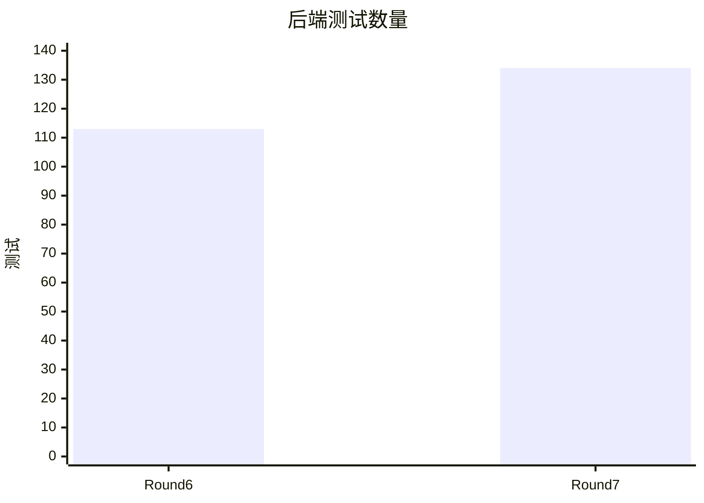

# Round 7 对比（迭代 061–070）

> 过程记录（R-11）。科研交付物在 [aidoc 论文](../../../aidoc/028127fc-3b3a-4b4b-93ec-02beb626d776/main.tex)，本文件不充当科研产物。Round 7 实际在 `main` 完成；没有追认不存在的轮次分支或推送。

## 上轮快照与本轮变化

| 指标 | Round 6 结束 | Round 7 结束 | 证据与边界 |
| --- | ---: | ---: | --- |
| 后端测试 | 113 | 134 | 迭代 061 结构门禁 +1；迭代 068 的质量命令报告 134/134。 |
| 图布局门禁 | 6 张、0 缺陷 | 6 张、0 缺陷 | `npm run check:diagrams`。 |
| 项目科研产物 | GSM8K 思维链消融稿 | 新增 GADBench Reddit 可解释图异常检测英文稿，10 页 | 迭代 068–070 的运行和编译记录；并非多图、多数据集结论。 |
| GPT Image 2 | 无编辑器调用入口 | 编辑器已生成 PNG | 迭代 068 的本地产品运行。 |
| 仓库内研究数据 | GSM8K 600 次完整生成 | 保留 600 次记录，另纳入 GADBench 六文件精简运行副本 | 迭代 065、068；解释实验只有 9 个成功节点。 |



## 十次迭代

| 迭代 | 本轮改变 | 可回查证据 |
| --- | --- | --- |
| 061 | 给论文 Results、数据来源图和图题增加结构门禁。 | `check-paper-structure.mjs`；破坏实验使门禁变红。 |
| 062 | 跨脚本去重尝试误删内容后回滚，扩展文档落点测试。 | 迭代日志记录损伤、回滚及双 driver 测试。 |
| 063 | 安全地把 6 份 `loadDotEnv` 收敛成共享函数。 | 逐文件 diff 和 `node --check`；114 项测试通过。 |
| 064 | 验证去重与研究交付数据完整性。 | 114 项测试、600 条 / 200 题记录、6 图无布局缺陷。 |
| 065 | 修路径边界和概览误报，补测单条 HTTP 502。 | 126 项测试；解析失败 2 → 1，准确率不变。 |
| 066 | 重写中英文 README，校正研究流程文档。 | 126 项测试、相对链接检查。 |
| 067 | 以项目工作流写作 32 次门禁试点论文和 SVG 机制框图。 | 4 页编译、结构门禁通过；实验结果仍待独立复评。 |
| 068 | 改做 GADBench Reddit 图异常检测；接入 GPT Image 2。 | 项目 Experiment Run、图与脚本副本、134 项测试。 |
| 069 | 把研究稿全文翻成英文。 | 应用内 Tectonic 编译 7 页。 |
| 070 | 扩写方法、相关工作与附录。 | 从归档结果核对数值；应用内 Tectonic 编译 10 页。 |

## 决策与遗留

- 研究结论限定在一张 Reddit 图、三组共享拓扑的 mask 和小规模边扰动试点；实验 Evidence 仍需人工确认。没有边级解释真值。
- 迭代 062 暴露批量正则重构会误删代码；063–064 改为逐文件替换和回归检查。
- 多 Agent 委派、对话约束和内置约束真实开关在本轮末尚未实现，留给 Round 8。
- 本轮没有按原计划新建独立分支或推送；迭代 080 核对轮次后，在 070 的提交上补建了本地 `round-07-complete` 注释 tag，不把它写成当时已存在的发布记录。

## 复现

```bash
npm run quality
node scripts/check-paper-structure.mjs
node --test apps/backend/test/documentLanding.test.js
```

更细的运行 ID、样本界限和图件校验见 [迭代日志](../iterations.md)。
