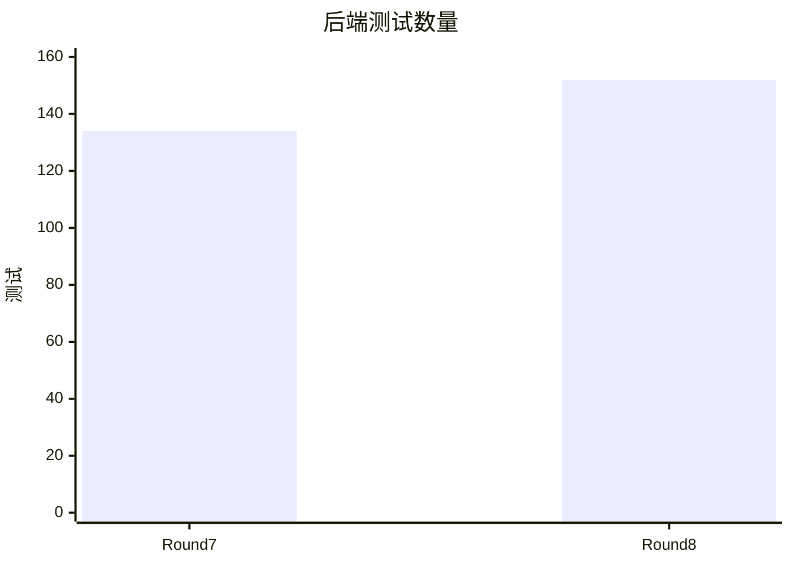

# Round 8 对比（迭代 071–080）

> 过程记录（R-11）。本轮按用户要求直接在 `main` 迭代；真实研究文档仍在 `aidoc/`。本文件区分假适配器验收与真实外部模型验收。

## 上轮快照与本轮变化

| 指标 | Round 7 结束 | Round 8 结束 | 证据与边界 |
| --- | ---: | ---: | --- |
| 后端测试 | 134 | 152 | `npm run quality`；类型检查、构建和 6 图布局门禁同步通过。 |
| 子 Agent 委派 | 只有单 Run、角色定义 | 写作阶段 2 个只读子 Run + 1 个协调 Run | 只用假适配器验收顺序、恢复、证据门禁和界面；真实模型对照未完成。 |
| 聊天约束 | 无对话新增规则链路 | 3 类精确规则，可提案、修订、确认、关闭、审计 | 生成代码和测试，确认后强制；不支持任意语义规则。 |
| 内置约束开关 | 策略文件只投影 | C-10、C-16 在运行时生效 | 核心约束仍不可关闭；保留资源绝对上限和部署环境总开关。 |
| 编辑器检索模型并发 | 最多 4 个查询同时调用 | 按查询串行调用 | 迭代 080 代码路径检查；尚未对外部模型实跑。 |



## 十次迭代

| 迭代 | 本轮改变 | 可回查证据 |
| --- | --- | --- |
| 071 | 修英文论文中 TikZ 流程图说明溢出。 | 应用内编译 10 页，目视检查边框内换行。 |
| 072 | 核查子 Agent 缺口，形成实施计划与五项任务。 | `tasks/plan.md`、`tasks/todo.md`；134 项测试。 |
| 073 | 父子 Run 谱系、深度和能力收窄。 | 越权、跨项目、101 条历史归档负例；136 项测试。 |
| 074 | 串行运行两名审查子 Agent，再交给协调 Run。 | 假适配器顺序、失败恢复和取消测试；139 项测试。 |
| 075 | 写作阶段可显式选择多 Agent，继续经过证据与人工门禁。 | 纵向集成测试；140 项测试。 |
| 076 | 界面展示各 Run、意见、错误和用量。 | 内置浏览器假适配器流程；真实模型未验收。 |
| 077 | 聊天提议三类可执行约束，确认后落盘并强制。 | 假模型纵向测试、门禁红绿实验；147 项测试。 |
| 078 | 消除内置策略只显示不生效的空开关。 | C-10/C-16 行为负例、设置页浏览器检查；151 项测试。 |
| 079 | 人工可修正 AI 的待确认规则。 | 路由负例与内置浏览器修订流程；152 项测试。 |
| 080 | 删除编辑器检索中的并发模型调用。 | 四个调用点改为顺序路径；质量门禁仍绿。 |

## 决策与遗留

- 真实多 Agent 模型验收仍缺：现有科研内容发送到配置的外部端点曾被自动审批拒绝。未经新的明确授权，不把假适配器结果记为真实模型对照。
- 聊天约束只覆盖回复/补丁的字面词句和补丁路径；不能保证论文事实、语言或图形质量。
- 角色注册表已有 8 个角色，但 `/api/llm` 的编辑器论文检索辅助仍是直接模型入口；“全部 AI 入口由角色强制”的验收尚未完成。
- Round 8 的主分支变更尚未推送；本地 `round-08-complete` 注释 tag 标记 080 收尾，不追认未创建的轮次分支。

## 复现

```bash
npm run quality
node --test apps/backend/test/constraintPolicyRuntime.test.js
node --test apps/backend/test/constraintProposals.test.js
node --test apps/backend/test/writingDelegation.test.js
```

详细代码、运行 ID 和门禁记录见 [迭代日志](../iterations.md) 与 [当前状态](../README.md)。
